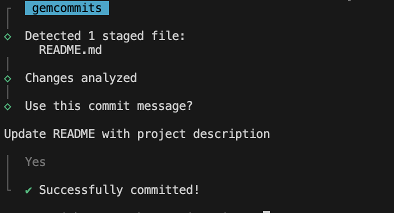

<div align="center">
  <div>
    
    <h1 align="center">Gem Commits</h1>
  </div>
	<p>A CLI that writes your Git commit messages for you with AI. Never write a commit message again. This is a fork of <a href="https://github.com/Nutlope/aicommits">aicommits</a>, which was modified to use Gemini instead of OpenAI. Huge thanks go to them for open-sourcing their work.</p>
	<a href="https://www.npmjs.com/package/gemcommits"></a>
</div>

---

## Setup

> The minimum supported version of Node.js is the latest v14. Check your Node.js version with `node --version`.

1. Install _gemcommits_:

   ```sh
   npm install -g gemcommits
   ```

2. Retrieve your API key from [Google AI Studio](https://aistudio.google.com/app/apikey)

   > Note: If you haven't already, you'll have to create a Google account and get access to the Gemini API.

3. Set the key so gemcommits can use it:

   ```sh
   gemcommits config set GEMINI_KEY=<your token>
   ```

   This will create a `.gemcommits` file in your home directory.

### Upgrading

Check the installed version with:

```
gemcommits --version
```

If it's not the [latest version](https://github.com/mzazakeith/gemcommits/releases/latest), run:

```sh
npm update -g gemcommits
```

## Usage

### CLI mode

You can call `gemcommits` directly to generate a commit message for your staged changes:

```sh
git add <files...>
gemcommits
```

`gemcommits` passes down unknown flags to `git commit`, so you can pass in [`commit` flags](https://git-scm.com/docs/git-commit).

For example, you can stage all changes in tracked files with as you commit:

```sh
gemcommits --all # or -a
```

> 👉 **Tip:** Use the `gemc` alias if `gemcommits` is too long for you.

#### Auto-accepting the commit message

To automatically accept the first generated commit message without any interactive prompt, you can use the `--yes` flag:

```sh
gemcommits --yes # or -y
```

> **Note:** When using `--yes`, the committed message will be displayed in the CLI output for your reference.

#### Generate multiple recommendations

Sometimes the recommended commit message isn't the best so you want it to generate a few to pick from. You can generate multiple commit messages at once by passing in the `--generate <i>` flag, where 'i' is the number of generated messages:

```sh
gemcommits --generate <i> # or -g <i>
```

> Warning: this uses more tokens, meaning it costs more.

#### Generating Conventional Commits

If you'd like to generate [Conventional Commits](https://conventionalcommits.org/), you can use the `--type` flag followed by `conventional`. This will prompt `gemcommits` to format the commit message according to the Conventional Commits specification:

```sh
gemcommits --type conventional # or -t conventional
```

This feature can be useful if your project follows the Conventional Commits standard or if you're using tools that rely on this commit format.

### Git hook

You can also integrate _gemcommits_ with Git via the [`prepare-commit-msg`](https://git-scm.com/docs/githooks#_prepare_commit_msg) hook. This lets you use Git like you normally would, and edit the commit message before committing.

#### Install

In the Git repository you want to install the hook in:

```sh
gemcommits hook install
```

#### Uninstall

In the Git repository you want to uninstall the hook from:

```sh
gemcommits hook uninstall
```

#### Usage

1. Stage your files and commit:

   ```sh
   git add <files...>
   git commit # Only generates a message when it's not passed in
   ```

   > If you ever want to write your own message instead of generating one, you can simply pass one in: `git commit -m "My message"`

2. gemcommits will generate the commit message for you and pass it back to Git. Git will open it with the [configured editor](https://docs.github.com/en/get-started/getting-started-with-git/associating-text-editors-with-git) for you to review/edit it.

3. Save and close the editor to commit!

## Configuration

### Reading a configuration value

To retrieve a configuration option, use the command:

```sh
gemcommits config get <key>
```

For example, to retrieve the API key, you can use:

```sh
gemcommits config get GEMINI_KEY
```

You can also retrieve multiple configuration options at once by separating them with spaces:

```sh
gemcommits config get GEMINI_KEY generate
```

### Setting a configuration value

To set a configuration option, use the command:

```sh
gemcommits config set <key>=<value>
```

For example, to set the API key, you can use:

```sh
gemcommits config set GEMINI_KEY=<your-api-key>
```

You can also set multiple configuration options at once by separating them with spaces, like

```sh
gemcommits config set GEMINI_KEY=<your-api-key> generate=3 locale=en
```

### Options

#### GEMINI_KEY

Required

The Gemini API key. You can retrieve it from [Google AI Studio API Keys page](https://aistudio.google.com/app/apikey).

#### locale

Default: `en`

The locale to use for the generated commit messages. Consult the list of codes in: https://wikipedia.org/wiki/List_of_ISO_639-1_codes.

#### generate

Default: `1`

The number of commit messages to generate to pick from.

Note, this will use more tokens as it generates more results.

#### model

Default: `gemini-2.5-flash`

The Gemini model to use. Supported models include:
- `gemini-3.1-pro-preview` - Gemini 3.1 Pro Preview (State-of-the-art)
- `gemini-3.1-flash-lite-preview` - Gemini 3.1 Flash Lite Preview (High-volume)
- `gemini-3-flash-preview` - Gemini 3 Flash Preview (Fast and capable)
- `gemini-2.5-flash` (default) - Fast and efficient
- `gemini-2.5-pro` - More capable but slower

> Tip: `gemini-3.1-pro-preview` provides state-of-the-art reasoning but may be slower than Flash models.

#### timeout

The timeout for network requests to the Gemini API in milliseconds.

Default: `10000` (10 seconds)

```sh
gemcommits config set timeout=20000 # 20s
```

#### max-length

The maximum character length of the generated commit message.

Default: `50`

```sh
gemcommits config set max-length=100
```

#### type

Default: `""` (Empty string)

The type of commit message to generate. Set this to "conventional" to generate commit messages that follow the Conventional Commits specification:

```sh
gemcommits config set type=conventional
```

You can clear this option by setting it to an empty string:

```sh
gemcommits config set type=
```

## How it works

This CLI tool runs `git diff` to grab all your latest code changes, sends them to Google's Gemini AI, then returns the AI generated commit message.


## Contributing

If you want to help fix a bug or implement a feature in [Issues](https://github.com/mzazakeith/gemcommits/issues), checkout the [Contribution Guide](CONTRIBUTING.md) to learn how to setup and test the project
